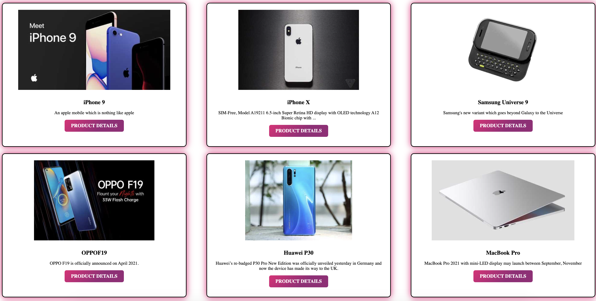

## Cards-NextJS

This is nextjs app Using dummy API and fetching products and render them on the home page.

## Link

deployed at: https://nextjs-cards.netlify.app/

## Description

This is nextjs app Using dummy API and fetching products and render them on the home page.
Each product is a card with a title, description, image and a link to its own page. Dynamic pages for each product are created.
The app utilizes Nextjs, React, CSS, node.js to deliver a user-friendly and visually appealing experience.

## Screenshots

## Installations

Clone the repository to your local machine.
Install the required dependencies using npm install.
Start the app using npm run dev.
Open your browser and navigate to http://localhost:3000

## License

Please refer to the LICENSE in the repo.